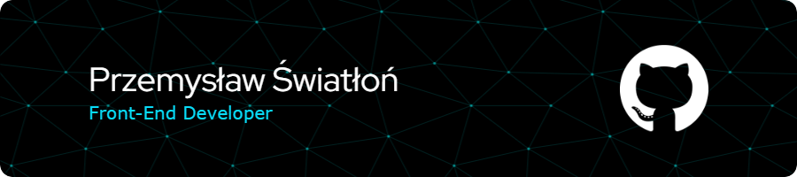

<!-- 

    
    
    
I gained knowledge about

    

        
        
        
        
        
        
        
    

    
How my year was looking ?

    

       
    

    
Actual project im working on:  
    <a href="https://github.com/IWiercik/learning-words-project">Learning-Word-APP</a>
    

 -->

## **I gained knowledge about**
 

## **How my year was looking**
 

## **Actual project im working on:**
 

### [Learnign-Words-APP](https://github.com/IWiercik/learning-words-project) ###